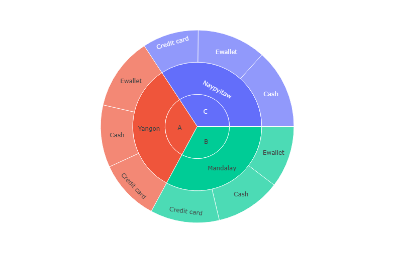

Summary
### [View Notebook](https://nbviewer.org/github/MaryChianumba/Supermarket-Sales-Analysis./blob/main/SUPERMARKET_SALES_ANALYSIS.ipynb)

1. Cash is the most used payment method with 34.7% of total sales
2. Branch C which is in the city of Naypyitaw made the highest sales
3. Fashion accessories has the highest average unit price, 57.1%
4. Despite Fashion accessories having the highest unit price, Food and beverages is the product with the highest sale ($56k)
5. Most of the sales were made on Saturday, while Monday had the least sales.
6. Most of the purchases were made by females.